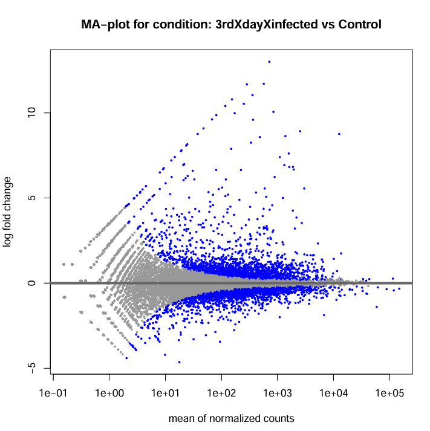
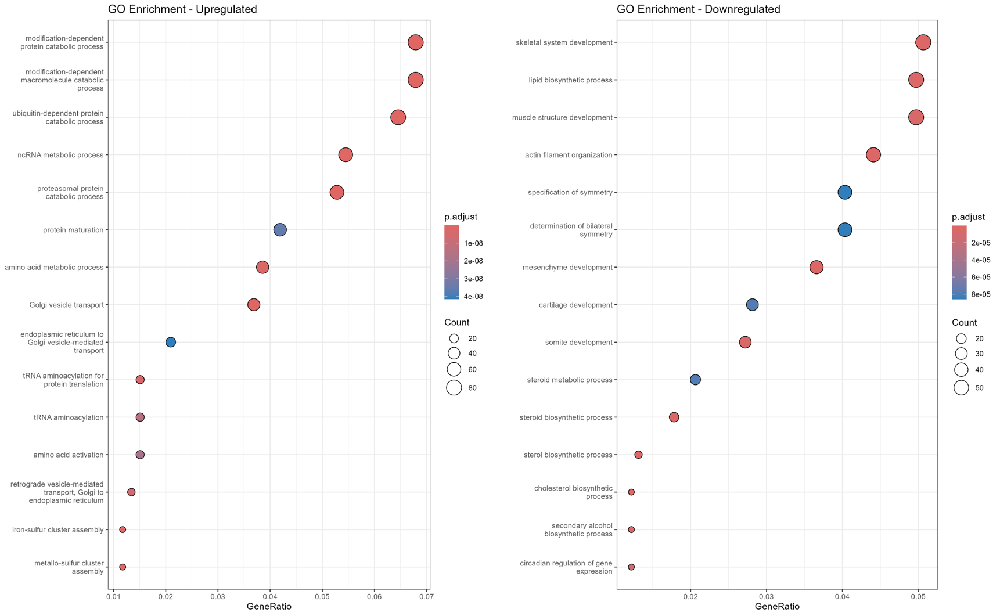
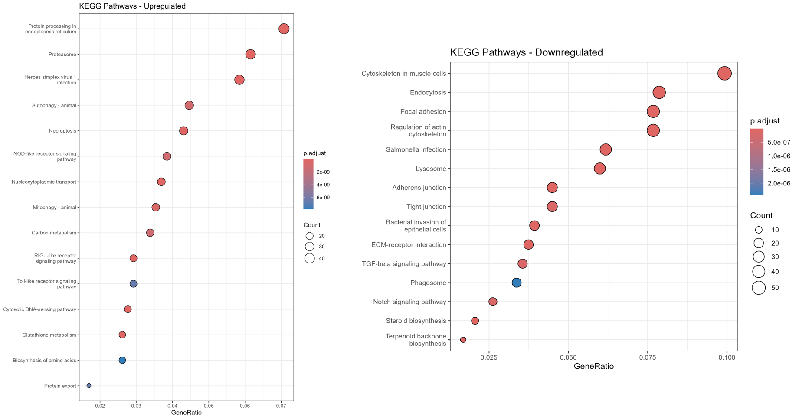
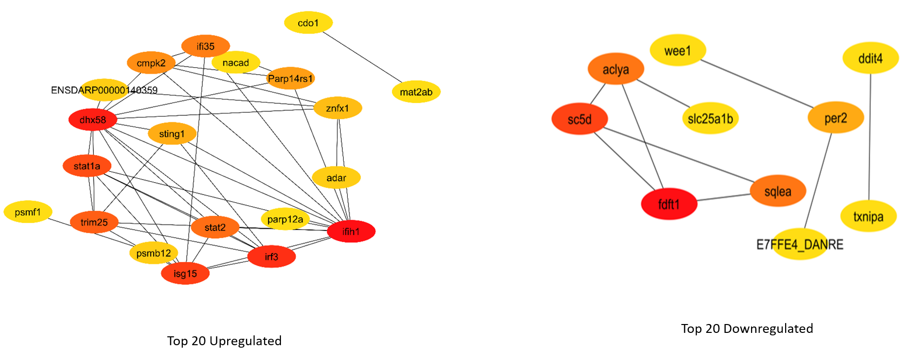

# RNA-seq Analysis of Viral Nervous Necrosis (VNN) To Study Host-Pathogen Interaction

## Overview
This project investigates host–pathogen interaction in fish cell lines infected with Viral Nervous Necrosis (VNN) using RNA-seq data.  
The goal was to identify differentially expressed genes and understand affected biological pathways across different time points of infection.

## Experimental Design
- Model system: Fish cell lines (in vitro infection)
- Conditions:
  - Day 3 vs Control
  - Day 5 vs Control
  - Day 3 vs Day 5

## Tools Used
- Galaxy platform
- R (DESeq2, clusterProfiler)
- STRING database
- Cytoscape

  ## Analysis Workflow
- Quality Control: FASTQC / Falco
- Trimming: Trimmomatic
- Alignment: HISAT2
- Counting: featureCounts
- Differential Expression: DESeq2
- Functional Enrichment: GO, KEGG (clusterProfiler)
- Network Analysis: STRING + Cytoscape

  # 📊 Results

## 🔹 Day 3 vs Control

### PCA

### Heatmap

### MA Plot

### GO Enrichment

### KEGG Pathway

### PPI Network

