# RNA-seq Analysis of Viral Nervous Necrosis (VNN) To Study Host-Pathogen Interaction

## Overview
This project investigates host–pathogen interaction in fish cell lines infected with Viral Nervous Necrosis (VNN) using RNA-seq data.  
The goal was to identify differentially expressed genes and understand affected biological pathways across different time points of infection.

## Experimental Design
- Model system: Fish cell lines (in vitro infection)
- Conditions:
  - Day 3 vs Control
  - Day 5 vs Control
  - Day 3 vs Day 5

## Tools Used
- Galaxy platform
- R (DESeq2, clusterProfiler)
- STRING database
- Cytoscape

  ## Analysis Workflow
- Quality Control: FASTQC / Falco
- Trimming: Trimmomatic
- Alignment: HISAT2
- Counting: featureCounts
- Differential Expression: DESeq2
- Functional Enrichment: GO, KEGG (clusterProfiler)
- Network Analysis: STRING + Cytoscape

  # Results

## Day 3 vs Control

### PCA
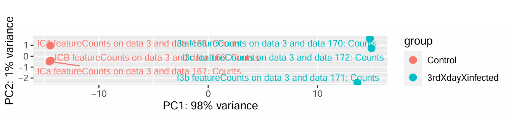

### Heatmap
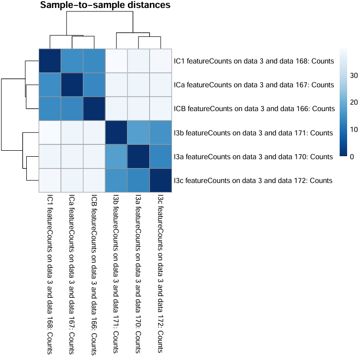

### MA Plot

### GO Enrichment

### KEGG Pathway

### PPI Network

**Interpretation:**  
Early infection (Day 3) shows enrichment of protein catabolic and ubiquitin-mediated processes, indicating active protein turnover and initial cellular response to viral infection.

## 🔹 Day 5 vs Control

### PCA
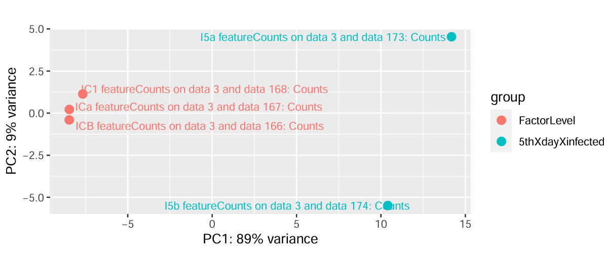

### Heatmap
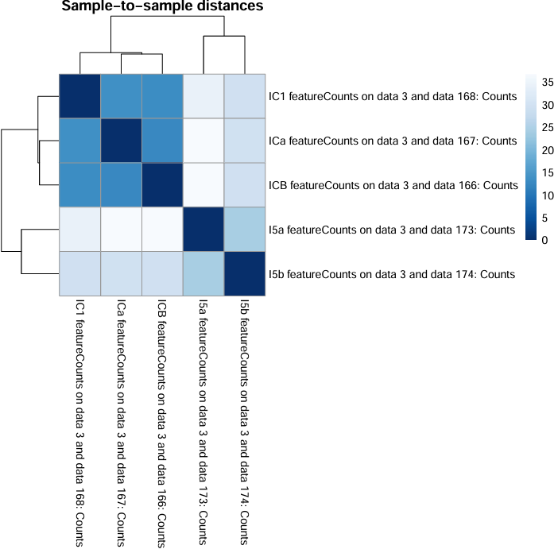

### MA Plot
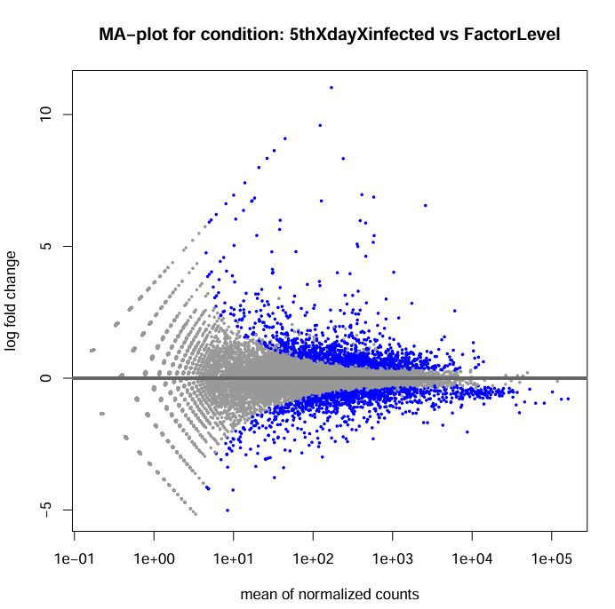

### GO Enrichment
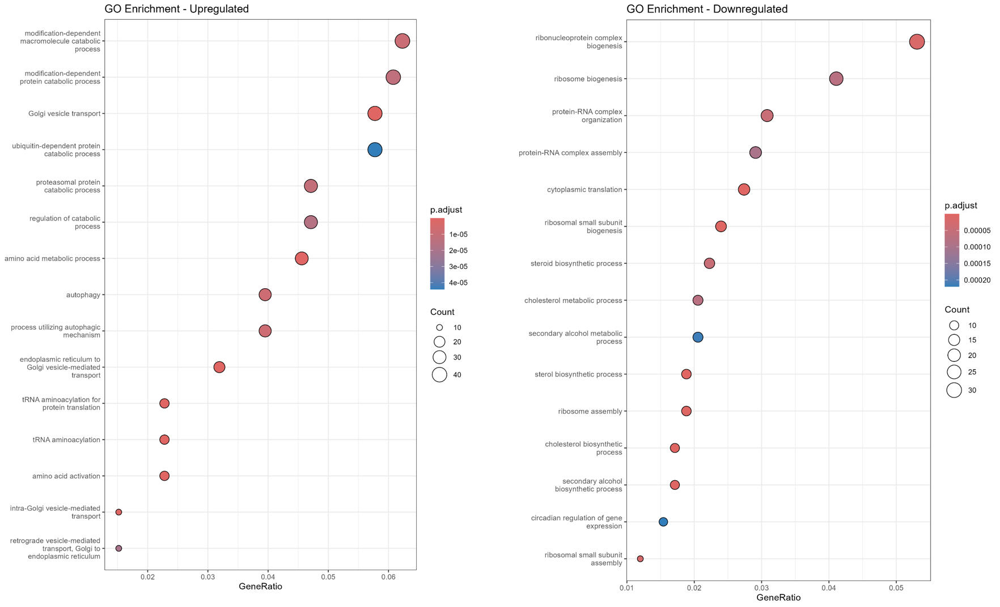

### KEGG Pathway
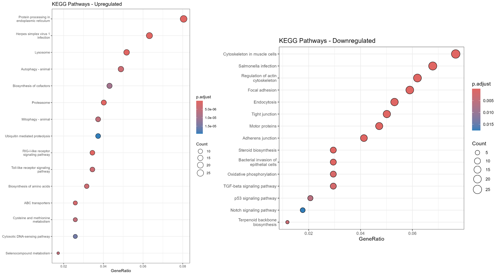

### PPI Network
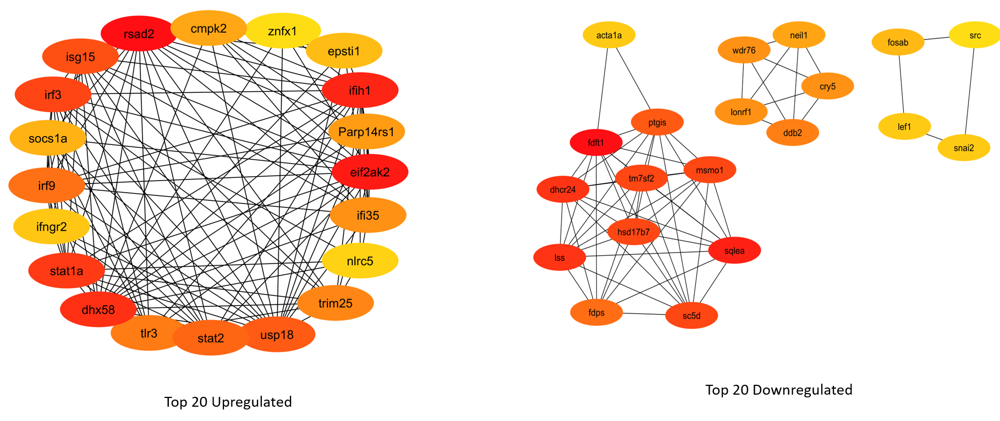

**Interpretation:**  
Later stage (Day 5) shows enrichment of ribosomal and immune-related processes, suggesting activation of protein synthesis and antiviral defense mechanisms.

## 🔹 Day 3 vs Day 5 (Optional Comparison)

### PCA
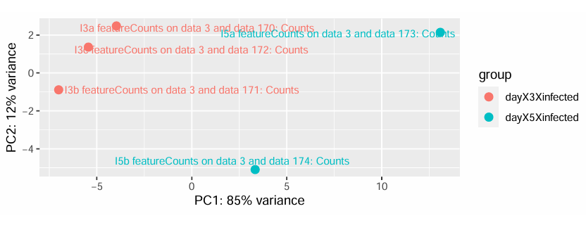

### Heatmap
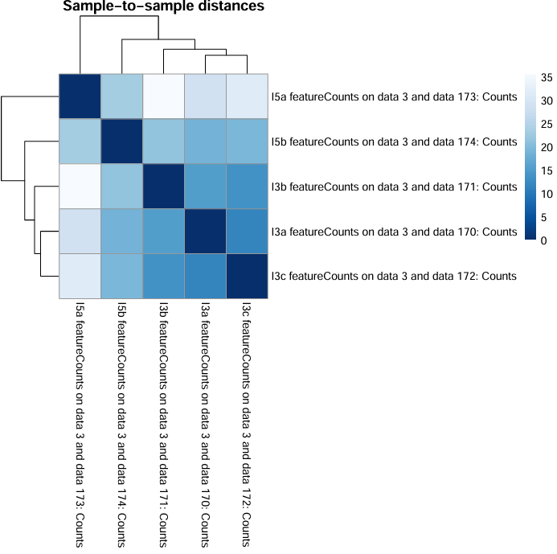

### MA Plot
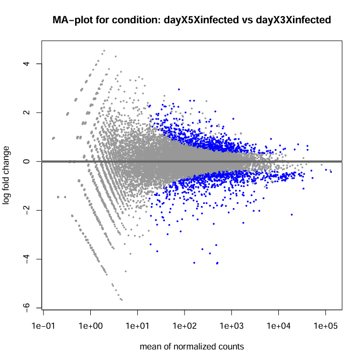

### GO Enrichment
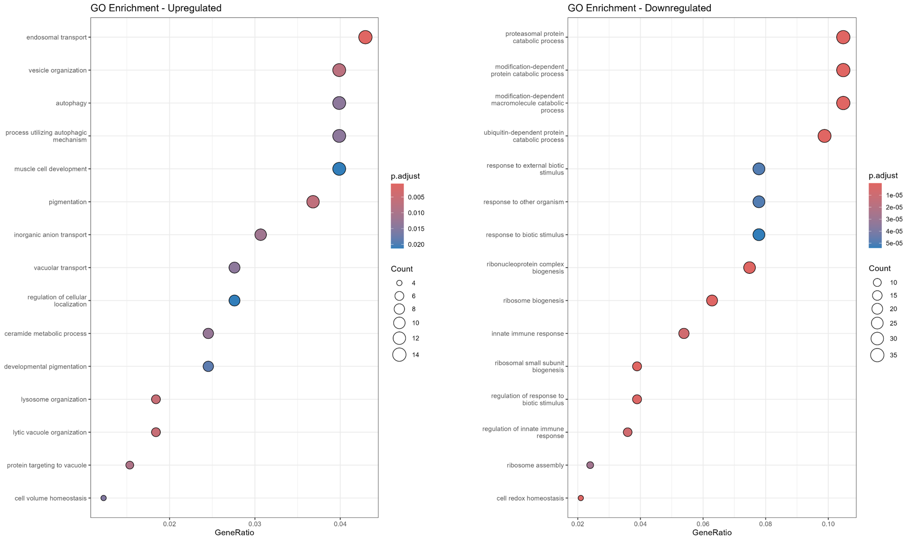

### KEGG Pathway
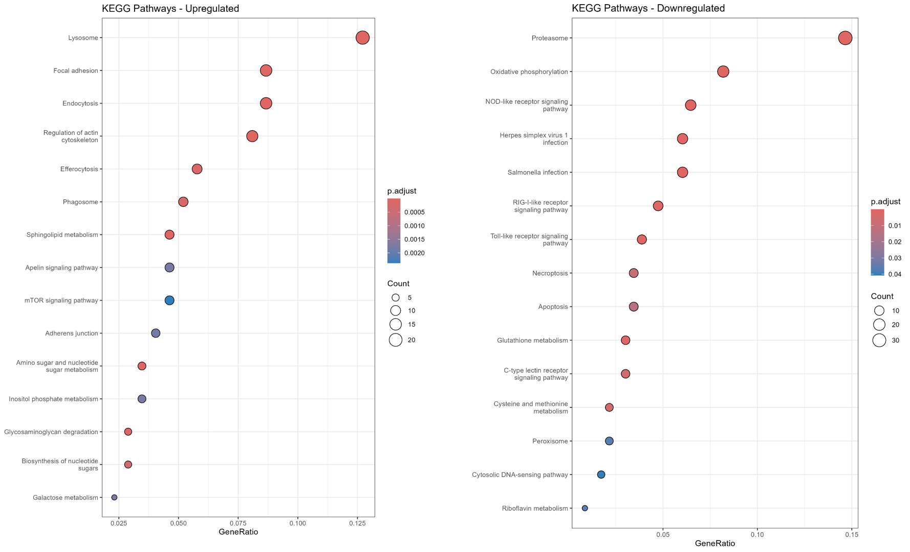

### PPI Network
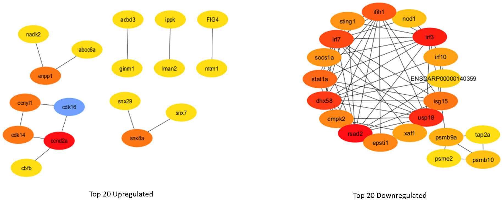

**Interpretation:**  
The comparison between Day 3 and Day 5 highlights a shift from early protein turnover and metabolic processes to enhanced ribosomal activity and immune-related responses, indicating progression toward a coordinated antiviral defense.

